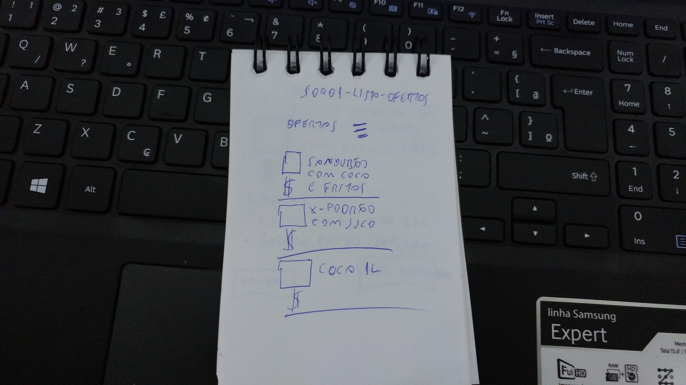
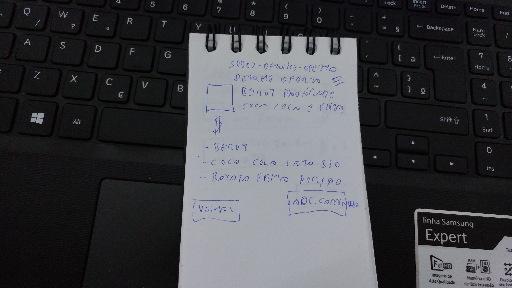
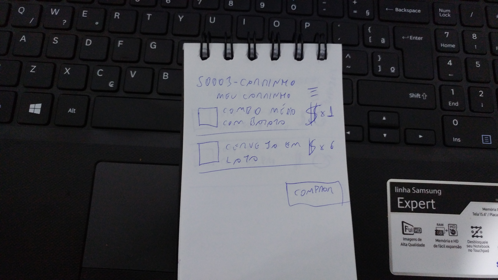
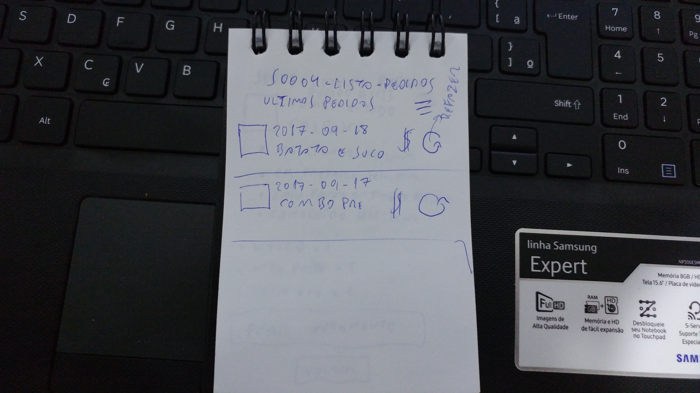
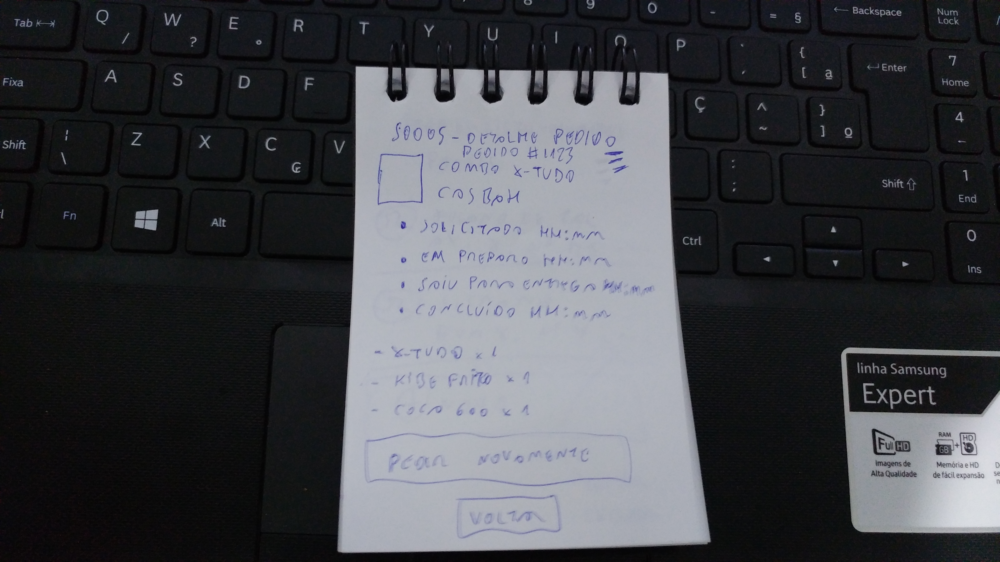
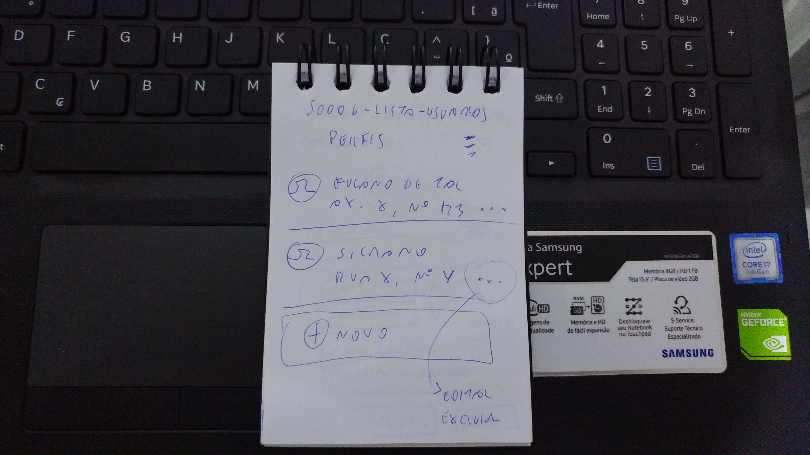
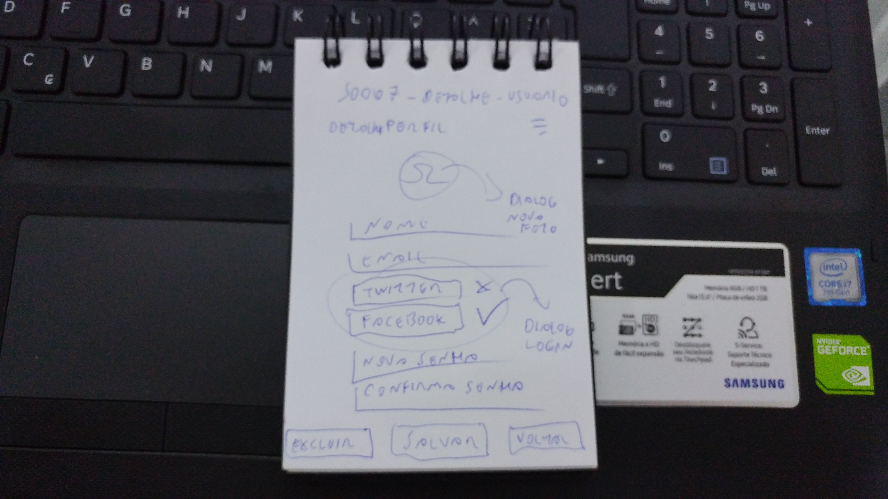

# ifce-2017.2-ergonomia-de-interface

- estudo em wireframe de um aplicativo de vender sanduíches online. deve conter um mockup de ao menos uma tela também
  - [sombriks](https://github.com/sombriks)
  - [macabeus](https://github.com/macabeus)

## feature-storm

- app pra pedir sanduíche de uma "sanduicharia"
- cardápio de ofertas
  - oferta tem pelo menos um sanduíche 
  - pode ter também batata frita, refrigerante, etc
- detalhes da oferta
  - itens, preço, etc
- carrinho
  - ofertas no carrinho
  - carrinho vira pedido
  - carrinho calcula valor da entrega
- pedidos anteriores
  - lista de pedidos
  - repetir pedido
    - alimenta o carrinho, pra deixar mudar alguma coisa
- detalhes de pedido
  - status do pedido (enviado, em preparo, cancelado, saiu para entrega, concluído)
  - formas de pagamento
    - não pode mexer em forma de pagamento de pedido concluído
  - ofertas do pedido
  - endereço de entrega
- detalhes de usuário
  - nome, email, login social, foto 
  - endereços
    - tem que ter um selecionado
  - na hora da compra, se não houver usuário cadastrado, 
  - trocar usuário

### features fora deste planejamento

- app da hamburgueria
- app administrativo

## Screen count

- S0001-lista-ofertas
- S0002-detalhe-oferta
- S0003-carrinho
- S0004-lista-pedidos
- S0005-detalhe-pedido
- S0006-lista-usuarios
- S0007-detalhe-usuario

## wireframe

## Mockup

**TBD**